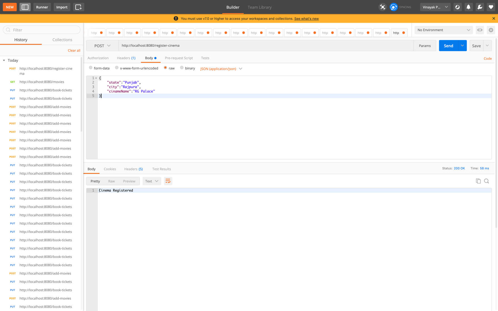
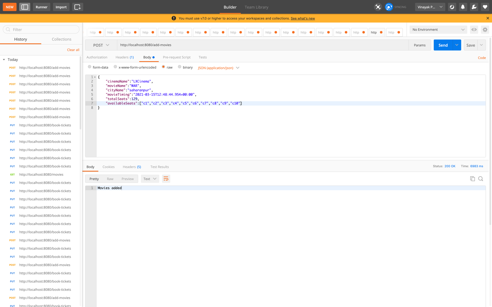
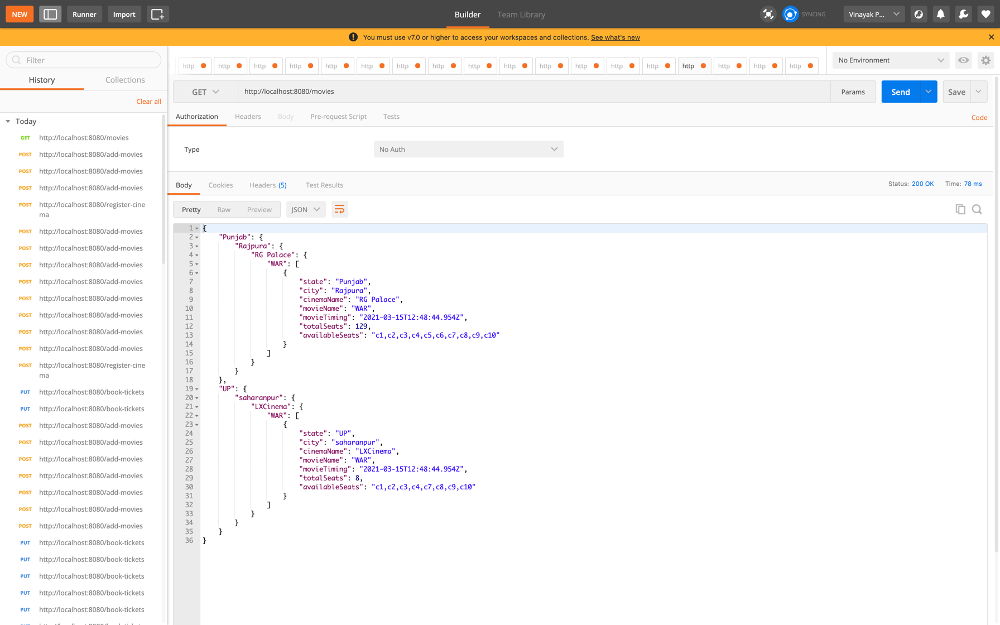
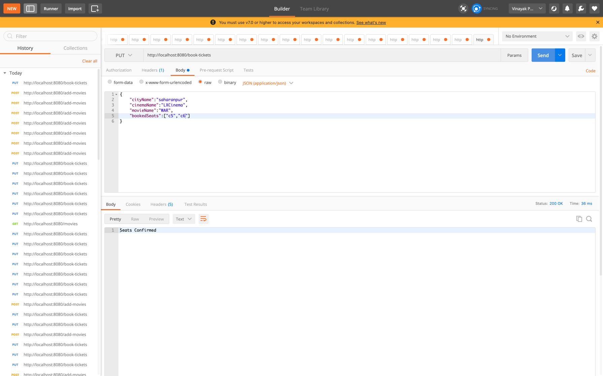

# Movies Mania
## Capabilities:
* Users can select any state and from any state they can select any city 
from any city they can select any cinema from any cinema they can select any movie.
* Movie consist of Movie Name, Timings , Total seats in cinema and available seats.
* Users can book only available seats.
* Two users can not book same seat simultaneously(Race Condition)
* Cinema Owners need to register their cinema on the portal to offer movies
* Cinema Owners can add any number of Movies in their cinema's if they are registerd with Movies Mania.

## Technical Details:
* The Microservice is designed using Java8 with springboot and Postgresql as 
relational database
* Microservice is very loosely coupled to accept any enhancements.
* The Data is scattered in different tables to make the best use of it and to provide the 
best abstraction.
* Table 1. Geographic data consist of state city and cinemaId
* Table 2. Cinema data consist of Cinema name,Cinema Id and city 
* Table 3. Movies data consist of Movie name ,Cinema id, MovieTimings,
Total available seats in cinema and the available seats to be booked.
*  To Display the movies of the cinema to the portal cinema should be registered.
APIS-:
   * Register Cinema-:
     Through this api cinema needs to be register prior before offering any movies
   * Add Movies-:
     Owner can add movies need to be displayed on the portal respective of state and city
   * Book Tickets-:
     User can directly choose the seats available and book the tickets .At backend it is first check that are the seats
     available or not and then book the seats usign synchronised locks
     to avoid race condition
    
Unit test cases are also covered to verify the logic
 
Screenshots-:
* Register Cinema-:

Add Movies-:

* Get Movies(different filters can be applied on different fields)
  
* Book Tickets(Seats Available)

* Book Tickets(Seats Not Available)

